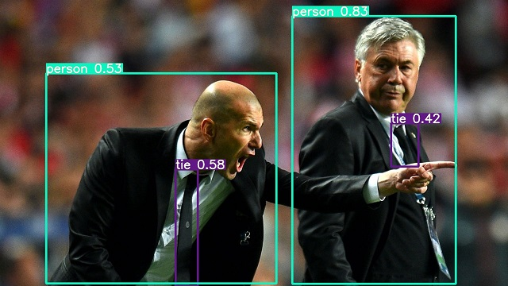

# Object Detection Pipeline
## What Object Detection and when do we use it? 
Object detection aims to predict bounding boxes around objects of interest. These bounding boxes are never rotated or skweed, their base will always be parallel to the image base. 

Bounding box predictions are usually very fast and are hence prefered over segmentation when speed is important. Since it is a box around the object, the actual shape of the object is not of importance to the task. 

For example: 



Along with the bounding box, the confidence score is also mentioned. This score tells us how sure the systems is that the object detected belongs to that particular class. 

## Choice of model: 
We povide 4 different models that you can work with - Y0, Y1, Y2, Y3. Y0 is the smallest model and Y3 is the largest. If your images contain complex shapes and lots of things in the scene, use a larger model. If the images are relatively simple, use smaller models. The smaller models are faster at both training as well as during inference. The larger models are marginally slower during inference but take much longer to train. 

For most applications, you can start with the Y2 model and move up or down based on the accuracy and time taken. 

## Annotation details: 
Each image's annotation file should be locatable by simply replacing /images/*.jpg with /labels/*.txt in its pathname. In the text file, each object present in the image has to be on a new line. The detaails of the line are as follows: 

    class_id x_center_of_bbox y_centre_of_bbox width_of_bbox height_of_bbox

The class id is an int value starting from 0 and refers to the position of the object in the array provided to the model. All values in the annotation file, except the ```class_id``` have to strictly be <= 1. The values must be normalized using the following formula:
    
    x_centre_new = x_center_original / width_of_image
    y_center_new = y_center_original / height_of_image

    bbox_width = origina;_bbox_width / width_of_image
    bbox_height = original_bbox_height / height_of_image

The online annotation tool we provide provides annotations in this format. 

## Function Definitions:
### 1. _object_detector()_ constructor
The constructor is robust and can be used for creating a new model as well as loading existing models.

#### Train from scratch: 
```python
object_detection = object_detector(model="Y0", classes=["Defect"])
object_detection.load_data(path="../Dataset/")
object_detection.train(epochs=5)
```

#### 2. _load\_data()_ function
This is used to build the dataset. The folder structure to be followed is provided below. If there is not validation folder, the system will automatically build the same with 20% of the train data. 

The path leads to the root folder that contains subfolders _Train_ and _Validation_
```python
object_detection.load_data(path="../Dataset/")
```
 
#### 3. _train()_ funciton
Used to train and save the model. most applications require around 75 epochs for best results. 

```python
object_detection.train(epochs=5)
```

#### 4. _detect()_ function
Provide path to folder containg the images or single file you want to test. Also provide which model you want to use to test the same. 
##### Folder prediction:
```python
detect(source="./Inference/images/", weights="weights/best.pt", out="./Inference/output/")
```
##### Single file prediction:
```python
detect(source="./Inference/images/0.jpg", weights="weights/best.pt", out="./Inference/output/")
```

## Example:
Common examples are provided in [Example.py](./Example.py)

## Folder structure to be followed:
For each image, there must be a corresponding mask with the same filename in the Labels folder. 
```
Root
    |--- Train
    |   |--- Images
    |   |   |--- File1.jpg
    |   |   |--- File2.jpg
    |   |   |--- File3.jpg
    |   |   |--- ...
    |   |--- Labels
    |   |   |--- File1.txt
    |   |   |--- File2.txt
    |   |   |--- File3.txt
    |   |   |--- ...
    |--- Validation
    |   |--- Images
    |   |   |--- File1.jpg
    |   |   |--- File2.jpg
    |   |   |--- File3.jpg
    |   |   |--- ...
    |   |--- Labels
    |   |   |--- File1.txt
    |   |   |--- File2.txt
    |   |   |--- File3.txt
    |   |   |--- ...
    |--- Test
    |   |--- Images
    |   |   |--- File1.jpg
    |   |   |--- File2.jpg
    |   |   |--- File3.jpg
    |   |   |--- ...

```